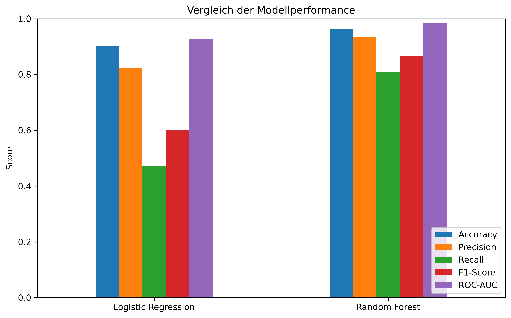
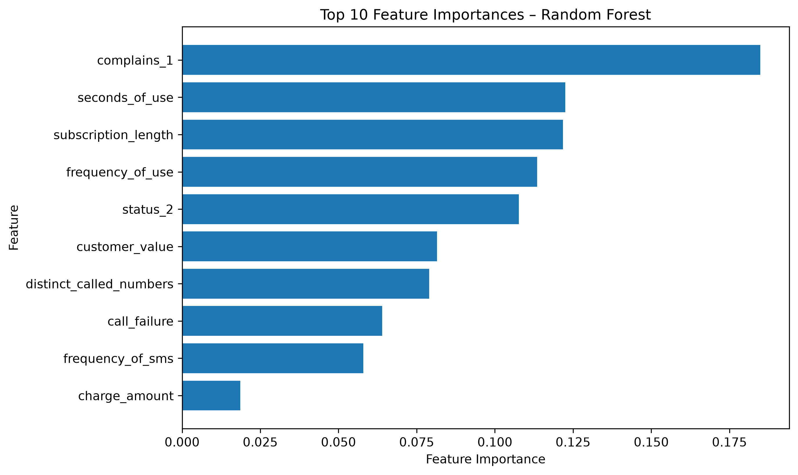
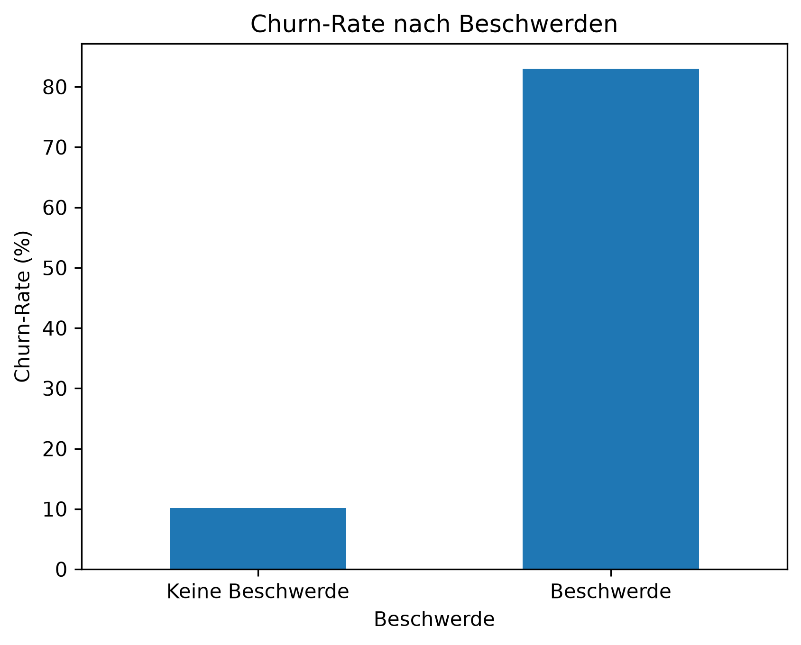
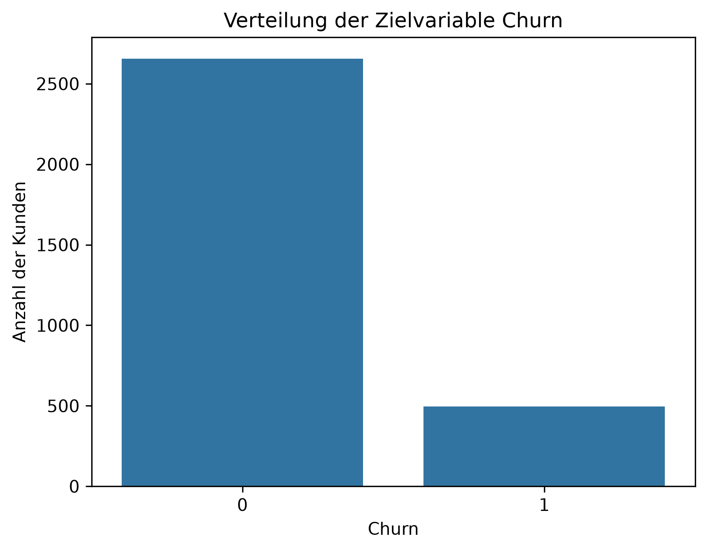

# Telecom Customer Churn Prediction

Dieses Projekt untersucht, wie sich Kundenabwanderung in einem Telekommunikationsdatensatz mithilfe von Machine Learning vorhersagen lässt.

Dafür wurden Kundendaten zunächst explorativ analysiert und bereinigt. Anschließend wurden eine Logistic Regression und ein Random Forest trainiert und anhand verschiedener Klassifikationsmetriken miteinander verglichen.

Der Fokus des Projekts liegt nicht nur auf der Modellperformance, sondern auch auf der Interpretation der Ergebnisse aus Business-Sicht: Welche Merkmale hängen besonders mit Kundenabwanderung zusammen und wie könnten solche Informationen zur frühzeitigen Identifikation gefährdeter Kunden genutzt werden?

## Projektziel

Customer Churn beschreibt den Verlust von Kunden, beispielsweise durch Kündigung oder Wechsel zu einem anderen Anbieter.

Ziel dieses Projekts ist es, auf Basis vorhandener Kunden- und Nutzungsmerkmale vorherzusagen, ob ein Kunde zur Churn-Klasse gehört. Dabei werden insbesondere folgende Fragen untersucht:

- Welche Merkmale unterscheiden Churn- und Non-Churn-Kunden?
- Welche Datenbereinigung und Aufbereitung ist für die Modellierung notwendig?
- Wie unterscheiden sich Logistic Regression und Random Forest bei der Vorhersage?
- Welche Bewertungsmetriken sind bei einer unausgeglichenen Zielvariable besonders relevant?
- Welche Business-Erkenntnisse lassen sich aus den Daten und den Modellergebnissen ableiten?

## Datensatz

Verwendet wird der **Iranian Churn Dataset** aus dem UCI Machine Learning Repository.

Der ursprüngliche Datensatz enthält:

- 3.150 Kundenbeobachtungen
- 13 Eingangsmerkmale
- die binäre Zielvariable `Churn`

Die Merkmale beschreiben unter anderem:

- Nutzungsintensität
- Nutzungshäufigkeit
- Beschwerden
- Tarifplan
- Kundenstatus
- Vertragsdauer
- Kundenwert

Die Eingangsmerkmale basieren auf aggregierten Kundendaten aus den ersten neun Monaten. Die Zielvariable beschreibt den Churn-Status am Ende eines zwölfmonatigen Beobachtungszeitraums.

Bei der Datenprüfung wurden keine fehlenden Werte festgestellt. Es wurden jedoch 300 vollständig duplizierte Beobachtungen gefunden, die vor der Modellierung entfernt wurden. Nach der Bereinigung enthält der Datensatz 2.850 Beobachtungen.


## Projektstruktur

```text
telecom-customer-churn/
│
├── data/
│   ├── raw/
│   │   └── iranian_churn.csv
│   └── processed/
│       └── iranian_churn_cleaned.csv
│
├── notebooks/
│   ├── 01_data_exploration.ipynb
│   ├── 02_data_preprocessing.ipynb
│   └── 03_modeling.ipynb
│
├── reports/
│   ├── business_insights.md
│   └── figures/
│       ├── churn_distribution.png
│       ├── churn_by_complaints.png
│       ├── model_comparison.png
│       └── random_forest_feature_importance.png
│
├── .gitignore
├── README.md
└── requirements.txt
```

## Vorgehensweise

### 1. Explorative Datenanalyse

Zunächst wurde der Datensatz hinsichtlich Struktur, Datentypen, fehlender Werte, Duplikate und Klassenverteilung untersucht.

Anschließend wurden Zusammenhänge zwischen verschiedenen Kundenmerkmalen und der Zielvariable `Churn` analysiert. Dazu wurden unter anderem Churn-Raten nach Beschwerden, Kundenstatus, Tarifplan und Alter betrachtet sowie Nutzungsmerkmale mithilfe von Boxplots untersucht.

Eine Korrelationsanalyse wurde zusätzlich genutzt, um Zusammenhänge und mögliche Redundanzen zwischen numerischen Merkmalen zu erkennen.

### 2. Datenbereinigung und Preprocessing

Im Preprocessing wurden:

- Spaltennamen vereinheitlicht,
- 300 vollständig duplizierte Beobachtungen entfernt,
- das redundante Merkmal `age_group` entfernt,
- numerische und kategoriale Features getrennt definiert.

Die Rohdaten wurden dabei nicht überschrieben. Stattdessen wurde ein separater bereinigter Datensatz für die Modellierung gespeichert.

### 3. Train/Test Split

Die bereinigten Daten wurden in 80 % Trainingsdaten und 20 % Testdaten aufgeteilt.

Da die Churn-Klasse deutlich seltener vorkommt, wurde ein stratifizierter Split verwendet. Dadurch bleibt die Klassenverteilung in Trainings- und Testdaten nahezu identisch.

Die Testdaten wurden während des Modelltrainings und beim Lernen der Preprocessing-Schritte nicht verwendet.

### 4. Logistic Regression

Die Logistic Regression wurde als gut interpretierbare Baseline für die binäre Klassifikation verwendet.

Numerische Features wurden mithilfe eines `StandardScaler` standardisiert. Kategoriale Features wurden mit einem `OneHotEncoder` transformiert.

Preprocessing und Modell wurden in einer gemeinsamen scikit-learn Pipeline kombiniert, damit alle Transformationen ausschließlich auf den Trainingsdaten gelernt werden.

### 5. Random Forest

Als zweites Modell wurde ein Random Forest Classifier verwendet.

Im Gegensatz zur Logistic Regression benötigt das baumbasierte Modell keine Standardisierung der numerischen Features. Kategoriale Features wurden weiterhin mittels One-Hot-Encoding aufbereitet.

Der Random Forest wurde gewählt, um auch nichtlineare Zusammenhänge und Interaktionen zwischen verschiedenen Kundenmerkmalen abbilden zu können.

### 6. Evaluation

Beide Modelle wurden anhand derselben Testdaten verglichen.

Verwendete Metriken:

- Accuracy
- Precision
- Recall
- F1-Score
- ROC-AUC
- Confusion Matrix

Aufgrund des Klassenungleichgewichts wurde die Modellleistung nicht allein anhand der Accuracy beurteilt. Für den Churn-Anwendungsfall wurde insbesondere berücksichtigt, wie viele tatsächlich abwandernde Kunden vom Modell erkannt werden.

## Ergebnisse

Die beiden Modelle zeigen deutliche Unterschiede bei der Erkennung der Churn-Klasse.

| Metrik | Logistic Regression | Random Forest |
|---|---:|---:|
| Accuracy | 0,902 | **0,961** |
| Precision | 0,824 | **0,935** |
| Recall | 0,472 | **0,809** |
| F1-Score | 0,600 | **0,867** |
| ROC-AUC | 0,928 | **0,985** |

Der Random Forest erzielt auf den Testdaten bei allen betrachteten Metriken bessere Ergebnisse.

Besonders relevant ist der Recall der Churn-Klasse. Die Logistic Regression erkennt 42 von 89 tatsächlichen Churn-Fällen, während der Random Forest 72 von 89 erkennt. Die Zahl der übersehenen Churn-Fälle sinkt dadurch von 47 auf 17.

Die hohe Accuracy allein wäre aufgrund des Klassenungleichgewichts nicht ausreichend zur Bewertung gewesen. Der Random Forest verbessert insbesondere Recall und F1-Score deutlich und erreicht gleichzeitig eine ROC-AUC von 0,985.

### Modellvergleich



### Overfitting

Der Random Forest erreicht auf den Trainingsdaten eine Accuracy von 99,6 %, einen F1-Score von 0,986 und eine ROC-AUC von 1,000.

Auf den Testdaten liegen die Werte bei 96,1 % Accuracy, 0,867 F1-Score und 0,985 ROC-AUC.

Die nahezu perfekte Trainingsperformance weist auf eine gewisse Overfitting-Tendenz hin. Da die Performance auf den unabhängigen Testdaten weiterhin hoch bleibt, zeigt das Modell im verwendeten Testdatensatz dennoch eine gute Generalisierungsfähigkeit.

## Wichtigste Merkmale des Random Forest

Die Feature Importance des Random Forest zeigt, welche Merkmale das Modell besonders stark für seine Entscheidungen verwendet.

Zu den wichtigsten Features gehören:

1. `complains_1`
2. `seconds_of_use`
3. `subscription_length`
4. `frequency_of_use`
5. `status_2`

Besonders auffällig ist das Merkmal für Kundenbeschwerden, das die höchste Feature Importance besitzt.

Interessant ist außerdem `subscription_length`: In der Korrelationsanalyse zeigte dieses Merkmal nur einen sehr geringen linearen Zusammenhang mit Churn, gehört im Random Forest jedoch zu den wichtigsten Features. Dies deutet darauf hin, dass nichtlineare Zusammenhänge oder Interaktionen mit anderen Merkmalen eine Rolle spielen können.

Feature Importances beschreiben die Bedeutung eines Merkmals innerhalb des trainierten Modells und dürfen nicht als kausale Effekte interpretiert werden.



## Business Insights

### Beschwerden als mögliches Frühwarnsignal

Kunden mit einer registrierten Beschwerde weisen im Datensatz eine deutlich höhere Churn-Rate auf als Kunden ohne Beschwerde. Gleichzeitig ist das Beschwerdemerkmal das wichtigste Feature des Random Forest.

Beschwerden könnten daher als relevantes Signal genutzt werden, um Kunden mit erhöhtem Abwanderungsrisiko frühzeitig zu identifizieren.



### Geringere Nutzung bei Churn-Kunden

Churn-Kunden zeigen im Durchschnitt eine deutlich geringere Nutzung:

| Merkmal | Non-Churn | Churn |
|---|---:|---:|
| Seconds of Use | 5.014,22 | 1.566,63 |
| Frequency of use | 76,98 | 29,13 |
| Customer Value | 535,51 | 124,81 |

Damit erscheint geringe Kundenaktivität als relevantes Signal für erhöhtes Churn-Risiko.

In einer praktischen Anwendung könnten solche Nutzungsindikatoren beispielsweise dabei helfen, gefährdete Kundengruppen für gezielte Retention-Maßnahmen zu priorisieren.

### Klassenverteilung

Bereits bei der explorativen Analyse zeigte sich eine deutliche Klassenungleichheit. Im ursprünglichen Datensatz entfallen rund 15,7 % der Beobachtungen auf die Churn-Klasse.

Dieses Ungleichgewicht war ein wesentlicher Grund dafür, neben der Accuracy auch Precision, Recall, F1-Score und ROC-AUC für die Modellbewertung zu verwenden.



## Limitationen

Bei der Interpretation der Ergebnisse müssen einige Einschränkungen berücksichtigt werden:

- Der Datensatz umfasst 3.150 ursprüngliche Beobachtungen und ist damit vergleichsweise klein.
- Es ist keine eindeutige Kunden-ID enthalten. Dadurch kann nicht zweifelsfrei festgestellt werden, ob identische Beobachtungen tatsächlich dieselben Kunden repräsentieren.
- Einige Features sind stark miteinander korreliert, beispielsweise `seconds_of_use` und `frequency_of_use`.
- Die Feature Importances des Random Forest zeigen modellinterne Bedeutung, erlauben aber keine kausalen Aussagen.
- Der Random Forest zeigt eine gewisse Overfitting-Tendenz, da die Trainingsperformance nahezu perfekt ist.
- Die Modellperformance wurde auf einem einzelnen Train/Test Split untersucht. Für eine robustere Bewertung wäre Cross-Validation sinnvoll.
- Die Ergebnisse beziehen sich ausschließlich auf den verwendeten Datensatz und lassen sich nicht ohne weitere Validierung auf andere Telekommunikationsunternehmen oder Kundengruppen übertragen.

## Mögliche Weiterentwicklungen

In einer weiteren Projektiteration könnten unter anderem folgende Punkte untersucht werden:

- Cross-Validation für eine robustere Bewertung der Modellperformance
- Hyperparameter-Tuning des Random Forest
- Anpassung des Klassifikationsschwellenwerts zur gezielten Optimierung des Recall
- Untersuchung von `class_weight` zur Berücksichtigung des Klassenungleichgewichts
- Vergleich mit weiteren Modellen wie Gradient Boosting
- Permutation Importance oder SHAP für eine detailliertere Modellinterpretation
- Validierung des Modells auf zusätzlichen oder aktuelleren Telecom-Daten

## Technologien

Für das Projekt wurden unter anderem folgende Technologien und Bibliotheken verwendet:

- Python 3.13
- pandas
- NumPy
- Matplotlib
- Seaborn
- scikit-learn
- Jupyter Notebook
- Git
- GitHub

## Projekt lokal ausführen

Repository klonen:

```bash
git clone https://github.com/selma1405/telecom-customer-churn.git
cd telecom-customer-churn
```

Virtuelle Python-Umgebung erstellen:

```bash
python -m venv .venv
```

Unter Windows PowerShell aktivieren:

```powershell
.\.venv\Scripts\Activate.ps1
```

Benötigte Python-Pakete installieren:

```bash
python -m pip install -r requirements.txt
```

Anschließend können die Jupyter Notebooks in folgender Reihenfolge ausgeführt werden:

1. `notebooks/01_data_exploration.ipynb`
2. `notebooks/02_data_preprocessing.ipynb`
3. `notebooks/03_modeling.ipynb`

## Datensatzquelle

Für das Projekt wurde der **Iranian Churn Dataset** aus dem UCI Machine Learning Repository verwendet.

Der Datensatz enthält aggregierte Nutzungs- und Kundenmerkmale eines Telekommunikationsunternehmens. Die Features basieren auf den ersten neun Monaten des Beobachtungszeitraums, während die Zielvariable den Churn-Status am Ende eines zwölfmonatigen Zeitraums beschreibt.

Lizenz: CC BY 4.0